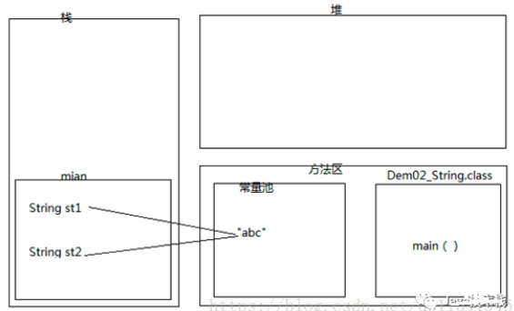
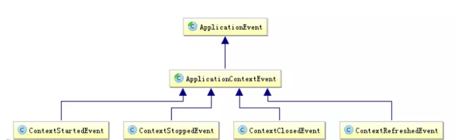
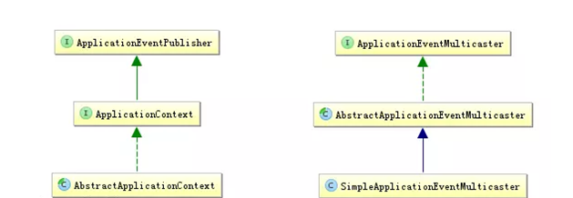
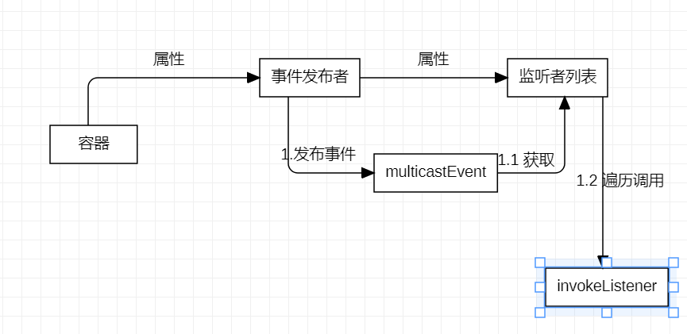
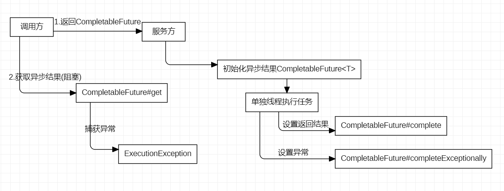
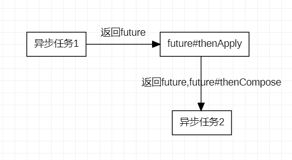
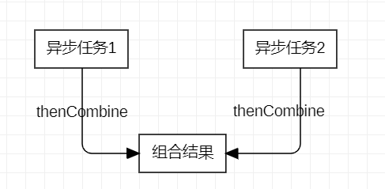

# 本项目为算法的Java实现
- [x] 顺序查找
- [x] 二分查找
- [x] B+树
- [x] 红黑树
- [ ] 快速排序
- [ ] 平衡二叉树
### 学习资料
 [B+树算法学习视频](https://www.youtube.com/channel/UCZCFT11CWBi3MHNlGf019nw/featured)  
 [B+树代码参考](https://github.com/jiaguofang/b-plus-tree)  
 [红黑树学习视频](https://www.youtube.com/channel/UCzDJwLWoYCUQowF_nG3m5OQ)  
 [快速排序算法学习视频](https://www.youtube.com/watch?v=7h1s2SojIRw)  
 [平衡二叉树](https://www.youtube.com/watch?v=jDM6_TnYIqE)  
 
### 常见问题积累
#### spring生命周期

1. spring只帮我们管理单例模式的bean的完整生命周期
2. BeanPostProcessor增强处理器：spring中所有bean在做初始化（非实例化和注入属性）时都会调用该接口的两个方法，可以用于对一些特殊的bean进行处理
3. *Aware接口：用于初始化bean时获得spring中的一些对象，如获取spring上下文、bean的名称等

#### 悲观锁和乐观锁
 1. synchronized和ReentrantLock都是悲观锁，不仅会对写操作加锁还会对读操作加锁
 2. 乐观锁认为资源和数据不会被修改，所以读取不会上锁，但是进行写入会判断当前数据是否被修改过
 3. 乐观锁实现方案：  **版本号机制** 和 **CAS实现**
 4. 乐观锁的缺点：ABA问题（对版本增加修改次数记录）、 循环开销大（自旋）
 
#### Serializable接口
1. 类的可序列化性通过实现Serializable接口
2. 可序列化的所有子类是可序列化的
3.  serialVersionUID如果没有指定，则根据属性自动生成。但如果新增属性，可能会导致反序列化时报错

#### explain查看mysql执行计划
1. type从好到差：system const > const > eq_ref > ref > fulltext > ref_of_null > unique_subquery > index_subquery > range > index > All
2. [造数据](https://windmt.com/2018/05/04/mysql-easily-generate-millions-of-test-data/) 
  2.1 导数据目录：show global variables like '%secure_file_priv%';  
  2.2 导入数据：load data infile '/var/lib/mysql-files/100w.txt' replace into table tmp_series;
3. [type类型实例](https://blog.csdn.net/dennis211/article/details/78170079)  
 3.1 sql 放在type.sql文件中
 
#### String

1. String str1 = new String("abc")  
  1.1 在内存创建两个对象：一个在堆内存，一个在常量池，堆内存对象是常量池对象的一个拷贝副本

### 异步编程（观察者模式）
#### [Spring中的事件监听机制](https://segmentfault.com/a/1190000020967936)
1. 在Spring中，事件：ApplicationEvent、事件监听者：ApplicationListener接口
2. Spring的事件默认是同步的（调用#pushEvent后处于阻塞） 
   2.1 好处： 单线程同步可以进行事务管理
 
(1) 事件：其继承自JDK的EventObject 
 
(1) 最终委托给ApplicationEventMulticaster#multicastEvent方法 
(2) 如果容器中没有ApplicationEventMulticaster实现类，则new 一个SimpleApplicationEventMulticaster 
   -->参考：AbstractApplicationContext#initApplicationEventMulticaster 
(3) 如果提供一个executor，就可以异步支持发布事件，否则为同步发布 
3. 总结

#### CompletableFuture的使用分析

1. supplyAsync方法会接受一个生产者(Supplier)作为参数，返回一个CompletableFuture 
  1.1 生产者方法由ForkJoinPool池中的某个执行线程
2. 对多个异步任务进行流水线操作 
   
  2.1 thenCompose方法允许对两个异步操作进行流水线，并且与前面的异步任务有依赖 
   
  2.2 thenCombine:将两个并行异步任务的结果组合起来 
3. 响应CompletableFuture的completion事件（thenAccept方法）
  
  
  

 
 
