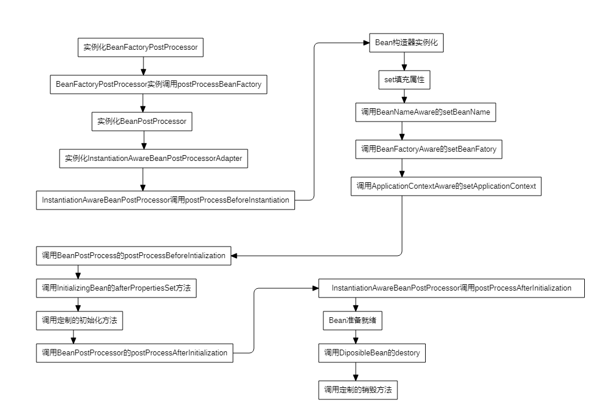

# 本项目为算法的Java实现
- [x] 顺序查找
- [x] 二分查找
- [x] B+树
- [x] 红黑树
- [ ] 快速排序
- [ ] 平衡二叉树
### 学习资料
 [B+树算法学习视频](https://www.youtube.com/channel/UCZCFT11CWBi3MHNlGf019nw/featured)  
 [B+树代码参考](https://github.com/jiaguofang/b-plus-tree)  
 [红黑树学习视频](https://www.youtube.com/channel/UCzDJwLWoYCUQowF_nG3m5OQ)  
 [快速排序算法学习视频](https://www.youtube.com/watch?v=7h1s2SojIRw)  
 [平衡二叉树](https://www.youtube.com/watch?v=jDM6_TnYIqE)  
 
### 常见问题积累
#### spring生命周期

1. spring只帮我们管理单例模式的bean的完整生命周期
2. BeanPostProcessor增强处理器：spring中所有bean在做初始化（非实例化和注入属性）时都会调用该接口的两个方法，可以用于对一些特殊的bean进行处理
3. *Aware接口：用于初始化bean时获得spring中的一些对象，如获取spring上下文、bean的名称等
 
